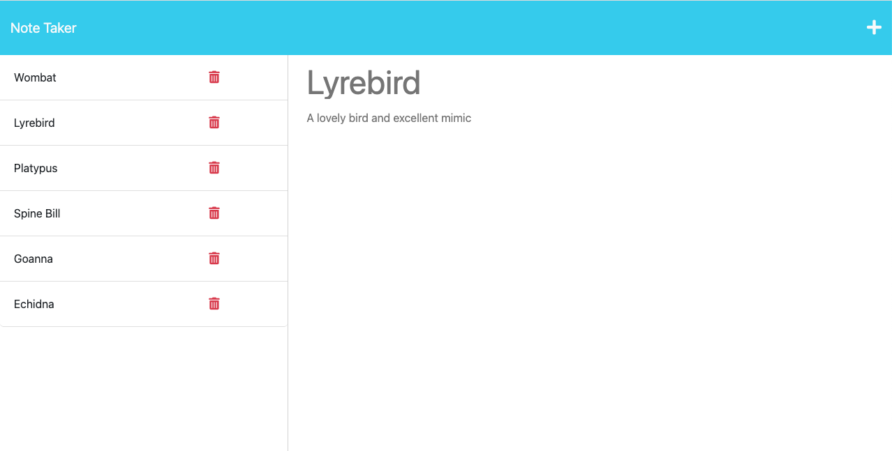

# The Note Taker

## Description
The Note Taker is a simple NoteBook application that allows items in a database to be viewed, added and deleted via a web page from front end. Access to the databasde, in this case a JSON file, is managed via a backend written in node.js and express.js.

The published application is running on the Heroku platform.

## Table of Contents
* [Published Application](#published-application-running-on-heroku)
* [Installation](#installation)
* [Usage](#usage)
* [Routing](#routing)
* [Change Log](#change-log)
* [License](#license)
* [Contributing](#contributing)
* [Tests](#tests)
* [Questions](#questions)

## Published Application running on Heroku
Click the link to view the [Note Taker on Heroku][def1]

## Installation
Note Taker requires node.js & express.js 4.16.4 & uuid 9.0.0 to be installed. You can clone the package from the GitHub Repository. Install Inquirer & Uuid by running npm install from the CLI.

## Usage
If cloned from GitHub the Project starts from the CLI by running 'node server.js'. The Note Taker has also been deployed to Heroku & will run automatically when the [Note Taker][def1] page loads.

## Routing

The API Routes have been organised for scalability if this app is developed further. API Routes and Page Routes have been separated and can be updated in isolation. Additional routing paths could be added without with minimal changes to existing code.

## Change Log
The [Change Log](./CHANGELOG.md) summarises the Note Taker development history.

## License
The Note Taker is available under the MIT License license. See the [LICENSE](https://opensource.org/licenses/MIT) file for more info.

## Contributing
Contributors are welcome. Feel free to clone or fork the project. Please let me know how you get on.

## Tests
Automated testing is not provided for this application. You can confirm functionality by creating, viewing and deleting Note Taker enties. 

## Questions
  
If you have questions about this project or would like more information you can [contact me by email](mailto:peter.medbury@dingogap.net.au).
  
You can see more of my work in my [Github Repository](https://github.com/dingogap).

## Resources Used
1. Bootcamp Materials - Lesson Material from Weeks 1 - 11
2. After Ahours & Group Tutoring
3. Prior knowledge and experience
4. [Express.js][def2] Router Documentation
5. [NPM Uuid][def3] Documentation
6. [Node.js Exports Shortcut][def4] Documentation
7. [Node Array Filtering][def5] Documentation

[def1]: https://medburys-note-book-1e4423ce39c5.herokuapp.com/
[def2]: https://expressjs.com/en/guide/routing.html#route-methods
[def3]: https://www.npmjs.com/package/uuid
[def4]: https://nodejs.org/api/modules.html#exports-shortcut
[def5]: https://developer.mozilla.org/en-US/docs/Web/JavaScript/Reference/Global_Objects/Array/filter
